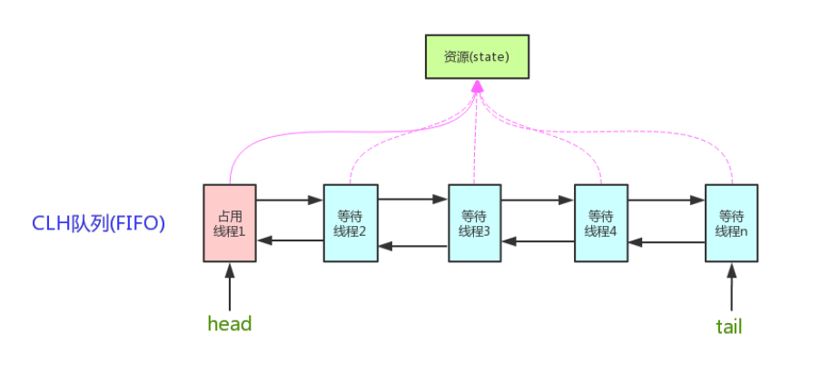
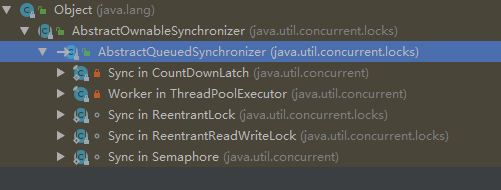
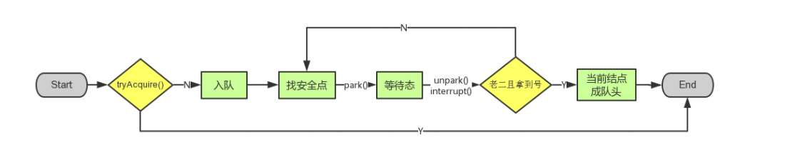

## AbstractQueuedSynchronizer(AQS)源码实现
大多数开发者不会直接用到AQS,但是它涵盖的范围极为广泛。AbstractQueuedSynchronizer是并发类诸如ReentrantLock、CountDownLatch、Semphore的核心。
CAS算法是AbstractQueuedSynchronizer的核心。如果不了解CAS算法的 [CAS算法理解](https://blog.csdn.net/weixin_39723544/article/details/86741358)

AbstractQueuedSynchronizer类底层的数据结构是使用双向链表，是队列的一种实现，故也可看成是队列，其中Sync queue，即同步队列，是双向链表，
包括head结点和tail结点，head结点主要用作后续的调度。而Condition queue不是必须的，其是一个单向链表，只有当使用Condition时，才会存在此单向链表。
并且可能会有多个Condition queue。
### 一、结构


它维护了一个volatile int state（代表共享资源）和一个FIFO线程等待队列（多线程争用资源被阻塞时会进入此队列）。这里volatile是核心关键词，具体volatile的语义，在此不述。state的访问方式有三种:

- getState()
- setState()
- compareAndSetState()

不同的自定义同步器争用共享资源的方式也不同。自定义同步器在实现时只需要实现共享资源state的获取与释放方式即可，至于具体线程等待队列的维护（如获取资源失败入队/唤醒出队等），AQS已经在顶层实现好了。自定义同步器实现时主要实现以下几种方法：

- isHeldExclusively()：该线程是否正在独占资源。只有用到condition才需要去实现它。
- tryAcquire(int)：独占方式。尝试获取资源，成功则返回true，失败则返回false。
- tryRelease(int)：独占方式。尝试释放资源，成功则返回true，失败则返回false。
- tryAcquireShared(int)：共享方式。尝试获取资源。负数表示失败；0表示成功，但没有剩余可用资源；正数表示成功，且有剩余资源。
- tryReleaseShared(int)：共享方式。尝试释放资源，如果释放后允许唤醒后续等待结点返回true，否则返回false。

以ReentrantLock为例，state初始化为0，表示未锁定状态。A线程lock()时，会调用tryAcquire()独占该锁并将state+1。
此后，其他线程再tryAcquire()时就会失败，直到A线程unlock()到state=0（即释放锁）为止，其它线程才有机会获取该锁。当然，释放锁之前，A线程自己是可以重复获取此锁的（state会累加），这就是可重入的概念。但要注意，获取多少次就要释放多么次，这样才能保证state是能回到零态的。

再以CountDownLatch以例，任务分为N个子线程去执行，state也初始化为N（注意N要与线程个数一致）。
这N个子线程是并行执行的，每个子线程执行完后countDown()一次，state会CAS减1。等到所有子线程都执行完后(即state=0)，
会unpark()主调用线程，然后主调用线程就会从await()函数返回，继续后余动作。

一般来说，自定义同步器要么是独占方法，要么是共享方式，他们也只需实现tryAcquire-tryRelease、
tryAcquireShared-tryReleaseShared中的一种即可。但AQS也支持自定义同步器同时实现独占和共享两种方式，
如ReentrantReadWriteLock。

### 二、继承关系


```
public abstract class AbstractQueuedSynchronizer
    extends AbstractOwnableSynchronizer
    implements java.io.Serializable { // 空 }
```

说明：从类继承关系可知，AbstractQueuedSynchronizer继承自AbstractOwnableSynchronizer抽象类，
并且实现了Serializable接口，可以进行序列化。而AbstractOwnableSynchronizer抽象类的源码如下：

```
public abstract class AbstractOwnableSynchronizer implements java.io.Serializable {

    private static final long serialVersionUID = 3737899427754241961L;

    // 构造函数
    protected AbstractOwnableSynchronizer() { }

    // 独占模式下的线程
    private transient Thread exclusiveOwnerThread;

    // 设置独占线程
    protected final void setExclusiveOwnerThread(Thread thread) {
        exclusiveOwnerThread = thread;
    }

    // 获取独占线程
    protected final Thread getExclusiveOwnerThread() {
        return exclusiveOwnerThread;
    }
}
```

说明：AbstractOwnableSynchronizer抽象类中，可以设置独占资源线程和获取独占资源线程。
分别为setExclusiveOwnerThread与getExclusiveOwnerThread方法，这两个方法会被子类调用。

### 三、内部类
AbstractQueuedSynchronizer类有两个内部类，分别为Node类与ConditionObject类。
#### 3.1 Node类
```
    static final class Node {

        // 模式，分为共享与独占
        // 共享模式
        static final Node SHARED = new Node();

        // 独占模式
        static final Node EXCLUSIVE = null;

        // 结点状态
        // CANCELLED，值为1，表示当前的线程被取消
        // SIGNAL，   值为-1，表示当前节点的后继节点包含的线程需要运行，也就是unpark
        // CONDITION，值为-2，表示当前节点在等待condition，也就是在condition队列中
        // PROPAGATE，值为-3，表示当前场景下后续的acquireShared能够得以执行
        // 值为0，表示当前节点在sync队列中，等待着获取锁
        static final int CANCELLED =  1;
        static final int SIGNAL    = -1;
        static final int CONDITION = -2;
        static final int PROPAGATE = -3;
        
        // 结点状态
        volatile int waitStatus;

        // 前驱结点
        volatile Node prev;

        // 后置结点
        volatile Node next;

        // 结点所对应的线程
        volatile Thread thread;

        // 下一个等待者
        Node nextWaiter;
        
        // 结点是否在共享模式下等待
        final boolean isShared() {
            return nextWaiter == SHARED;
        }

        // 获取前驱结点，若前驱结点为空，抛出异常
        final Node predecessor() throws NullPointerException {
            Node p = prev;
            if (p == null)
                throw new NullPointerException();
            else
                return p;
        }

        // 无参构造函数
        Node() {    // Used to establish initial head or SHARED marker
        }
        
        // 构造函数
        Node(Thread thread, Node mode) {     // Used by addWaiter
            this.nextWaiter = mode;
            this.thread = thread;
        }
        
        // 构造函数
        Node(Thread thread, int waitStatus) { // Used by Condition
            this.waitStatus = waitStatus;
            this.thread = thread;
        }
    }
```

说明：每个线程被阻塞的线程都会被封装成一个Node结点，放入队列。
每个节点包含了一个Thread类型的引用，并且每个节点都存在一个状态，具体状态（waitStatus）如下。

　　① CANCELLED，值为1，表示当前的线程被取消。

　　② SIGNAL，  值为-1，表示当前节点的后继节点包含的线程需要运行，需要进行unpark操作。

　　③ CONDITION，值为-2，表示当前节点在等待condition，也就是在condition queue中。

　　④ PROPAGATE，值为-3，表示当前场景下后续的acquireShared能够得以执行。

　　⑤ 值为0，表示当前节点在sync queue中，等待着获取锁

#### 3.2 ConditionObject类
```
public class ConditionObject implements Condition, java.io.Serializable {
        private static final long serialVersionUID = 1173984872572414699L;
        
        // condition队列的头结点
        private transient Node firstWaiter;
        // condition队列的尾结点
        private transient Node lastWaiter;

        // 构造函数
        public ConditionObject() { }

        // Internal methods

        // 添加新的waiter到wait队列
        private Node addConditionWaiter() {
            Node t = lastWaiter;
            // If lastWaiter is cancelled, clean out.
            if (t != null && t.waitStatus != Node.CONDITION) {
                unlinkCancelledWaiters();
                t = lastWaiter;
            }
            Node node = new Node(Thread.currentThread(), Node.CONDITION);
            if (t == null)
                firstWaiter = node;
            else
                t.nextWaiter = node;
            lastWaiter = node;
            return node;
        }

        /**
         * Removes and transfers nodes until hit non-cancelled one or
         * null. Split out from signal in part to encourage compilers
         * to inline the case of no waiters.
         * @param first (non-null) the first node on condition queue
         */
        private void doSignal(Node first) {
            do {
                if ( (firstWaiter = first.nextWaiter) == null)
                    lastWaiter = null;
                first.nextWaiter = null;
            } while (!transferForSignal(first) &&
                     (first = firstWaiter) != null);
        }

        /**
         * Removes and transfers all nodes.
         * @param first (non-null) the first node on condition queue
         */
        private void doSignalAll(Node first) {
            lastWaiter = firstWaiter = null;
            do {
                Node next = first.nextWaiter;
                first.nextWaiter = null;
                transferForSignal(first);
                first = next;
            } while (first != null);
        }

        // 从condition队列中清除状态为CANCEL的结点
        private void unlinkCancelledWaiters() {
            Node t = firstWaiter;
            Node trail = null;
            while (t != null) {
                Node next = t.nextWaiter;
                if (t.waitStatus != Node.CONDITION) {
                    t.nextWaiter = null;
                    if (trail == null)
                        firstWaiter = next;
                    else
                        trail.nextWaiter = next;
                    if (next == null)
                        lastWaiter = trail;
                }
                else
                    trail = t;
                t = next;
            }
        }

        // public methods

        // 唤醒一个等待线程。如果所有的线程都在等待此条件，则选择其中的一个唤醒。在从 await 返回之前，该线程必须重新获取锁
        public final void signal() {
            if (!isHeldExclusively())
                throw new IllegalMonitorStateException();
            Node first = firstWaiter;
            if (first != null)
                doSignal(first);
        }

        // 唤醒所有等待线程。如果所有的线程都在等待此条件，则唤醒所有线程。在从 await 返回之前，每个线程都必须重新获取锁
        public final void signalAll() {
            if (!isHeldExclusively())
                throw new IllegalMonitorStateException();
            Node first = firstWaiter;
            if (first != null)
                doSignalAll(first);
        }

        // 等待，当前线程在接到信号之前一直处于等待状态，不响应中断
        public final void awaitUninterruptibly() {
            Node node = addConditionWaiter();
            int savedState = fullyRelease(node);
            boolean interrupted = false;
            while (!isOnSyncQueue(node)) {
                LockSupport.park(this);
                if (Thread.interrupted())
                    interrupted = true;
            }
            if (acquireQueued(node, savedState) || interrupted)
                selfInterrupt();
        }

        /** Mode meaning to reinterrupt on exit from wait */
        private static final int REINTERRUPT =  1;
        
        /** Mode meaning to throw InterruptedException on exit from wait */
        private static final int THROW_IE    = -1;

        /**
         * Checks for interrupt, returning THROW_IE if interrupted
         * before signalled, REINTERRUPT if after signalled, or
         * 0 if not interrupted.
         */
        private int checkInterruptWhileWaiting(Node node) {
            return Thread.interrupted() ?
                (transferAfterCancelledWait(node) ? THROW_IE : REINTERRUPT) :
                0;
        }

        /**
         * Throws InterruptedException, reinterrupts current thread, or
         * does nothing, depending on mode.
         */
        private void reportInterruptAfterWait(int interruptMode)
            throws InterruptedException {
            if (interruptMode == THROW_IE)
                throw new InterruptedException();
            else if (interruptMode == REINTERRUPT)
                selfInterrupt();
        }

        // 等待，当前线程在接到信号或被中断之前一直处于等待状态
        public final void await() throws InterruptedException {
            if (Thread.interrupted())
                throw new InterruptedException();
            Node node = addConditionWaiter();
            int savedState = fullyRelease(node);
            int interruptMode = 0;
            while (!isOnSyncQueue(node)) {
                LockSupport.park(this);
                if ((interruptMode = checkInterruptWhileWaiting(node)) != 0)
                    break;
            }
            if (acquireQueued(node, savedState) && interruptMode != THROW_IE)
                interruptMode = REINTERRUPT;
            if (node.nextWaiter != null) // clean up if cancelled
                unlinkCancelledWaiters();
            if (interruptMode != 0)
                reportInterruptAfterWait(interruptMode);
        }

        //  等待，当前线程在接到信号、被中断或到达指定等待时间之前一直处于等待状态
        public final long awaitNanos(long nanosTimeout)
                throws InterruptedException {
            if (Thread.interrupted())
                throw new InterruptedException();
            Node node = addConditionWaiter();
            int savedState = fullyRelease(node);
            final long deadline = System.nanoTime() + nanosTimeout;
            int interruptMode = 0;
            while (!isOnSyncQueue(node)) {
                if (nanosTimeout <= 0L) {
                    transferAfterCancelledWait(node);
                    break;
                }
                if (nanosTimeout >= spinForTimeoutThreshold)
                    LockSupport.parkNanos(this, nanosTimeout);
                if ((interruptMode = checkInterruptWhileWaiting(node)) != 0)
                    break;
                nanosTimeout = deadline - System.nanoTime();
            }
            if (acquireQueued(node, savedState) && interruptMode != THROW_IE)
                interruptMode = REINTERRUPT;
            if (node.nextWaiter != null)
                unlinkCancelledWaiters();
            if (interruptMode != 0)
                reportInterruptAfterWait(interruptMode);
            return deadline - System.nanoTime();
        }

        // 等待，当前线程在接到信号、被中断或到达指定最后期限之前一直处于等待状态
        public final boolean awaitUntil(Date deadline)
                throws InterruptedException {
            long abstime = deadline.getTime();
            if (Thread.interrupted())
                throw new InterruptedException();
            Node node = addConditionWaiter();
            int savedState = fullyRelease(node);
            boolean timedout = false;
            int interruptMode = 0;
            while (!isOnSyncQueue(node)) {
                if (System.currentTimeMillis() > abstime) {
                    timedout = transferAfterCancelledWait(node);
                    break;
                }
                LockSupport.parkUntil(this, abstime);
                if ((interruptMode = checkInterruptWhileWaiting(node)) != 0)
                    break;
            }
            if (acquireQueued(node, savedState) && interruptMode != THROW_IE)
                interruptMode = REINTERRUPT;
            if (node.nextWaiter != null)
                unlinkCancelledWaiters();
            if (interruptMode != 0)
                reportInterruptAfterWait(interruptMode);
            return !timedout;
        }

        //  等待，当前线程在接到信号、被中断或到达指定等待时间之前一直处于等待状态。此方法在行为上等效于：awaitNanos(unit.toNanos(time)) > 0
        public final boolean await(long time, TimeUnit unit)
                throws InterruptedException {
            long nanosTimeout = unit.toNanos(time);
            if (Thread.interrupted())
                throw new InterruptedException();
            Node node = addConditionWaiter();
            int savedState = fullyRelease(node);
            final long deadline = System.nanoTime() + nanosTimeout;
            boolean timedout = false;
            int interruptMode = 0;
            while (!isOnSyncQueue(node)) {
                if (nanosTimeout <= 0L) {
                    timedout = transferAfterCancelledWait(node);
                    break;
                }
                if (nanosTimeout >= spinForTimeoutThreshold)
                    LockSupport.parkNanos(this, nanosTimeout);
                if ((interruptMode = checkInterruptWhileWaiting(node)) != 0)
                    break;
                nanosTimeout = deadline - System.nanoTime();
            }
            if (acquireQueued(node, savedState) && interruptMode != THROW_IE)
                interruptMode = REINTERRUPT;
            if (node.nextWaiter != null)
                unlinkCancelledWaiters();
            if (interruptMode != 0)
                reportInterruptAfterWait(interruptMode);
            return !timedout;
        }

        //  support for instrumentation

        // 查询是否有正在等待此条件的任何线程
        final boolean isOwnedBy(AbstractQueuedSynchronizer sync) {
            return sync == AbstractQueuedSynchronizer.this;
        }

        // 查询是否有正在等待此条件的任何线程
        protected final boolean hasWaiters() {
            if (!isHeldExclusively())
                throw new IllegalMonitorStateException();
            for (Node w = firstWaiter; w != null; w = w.nextWaiter) {
                if (w.waitStatus == Node.CONDITION)
                    return true;
            }
            return false;
        }

        // 返回正在等待此条件的线程数估计值
        protected final int getWaitQueueLength() {
            if (!isHeldExclusively())
                throw new IllegalMonitorStateException();
            int n = 0;
            for (Node w = firstWaiter; w != null; w = w.nextWaiter) {
                if (w.waitStatus == Node.CONDITION)
                    ++n;
            }
            return n;
        }

        // 返回包含那些可能正在等待此条件的线程集合
        protected final Collection<Thread> getWaitingThreads() {
            if (!isHeldExclusively())
                throw new IllegalMonitorStateException();
            ArrayList<Thread> list = new ArrayList<Thread>();
            for (Node w = firstWaiter; w != null; w = w.nextWaiter) {
                if (w.waitStatus == Node.CONDITION) {
                    Thread t = w.thread;
                    if (t != null)
                        list.add(t);
                }
            }
            return list;
        }
    }
```

说明：此类实现了Condition接口，Condition接口定义了条件操作规范，具体如下　

```
public interface Condition {

    // 等待，当前线程在接到信号或被中断之前一直处于等待状态
    void await() throws InterruptedException;

    // 等待，当前线程在接到信号之前一直处于等待状态，不响应中断
    void awaitUninterruptibly();

    // 等待，当前线程在接到信号、被中断或到达指定等待时间之前一直处于等待状态 s
    long awaitNanos(long nanosTimeout) throws InterruptedException;

    // 等待，当前线程在接到信号、被中断或到达指定等待时间之前一直处于等待状态。此方法在行为上等效于：awaitNanos(unit.toNanos(time)) > 0
    boolean await(long time, TimeUnit unit) throws InterruptedException;

    // 等待，当前线程在接到信号、被中断或到达指定最后期限之前一直处于等待状态
    boolean awaitUntil(Date deadline) throws InterruptedException;

    // Wakes up one waiting thread
    void signal();

    // Wakes up all waiting threads
    void signalAll();
}
```
### 四、AQS属性
```
    private static final long serialVersionUID = 7373984972572414691L;
   
    
    private transient volatile Node head;
    
    private transient volatile Node tail;

    private volatile int state;
    
    // 自旋时间
    static final long spinForTimeoutThreshold = 1000L;
    
    // Unsafe类实例
    private static final Unsafe unsafe = Unsafe.getUnsafe();
    
    // state内存偏移地址
    private static final long stateOffset;
    // head内存偏移地址
    private static final long headOffset;
    private static final long tailOffset;
    private static final long waitStatusOffset;
    private static final long nextOffset;
    
    // 静态初始化块
    static {
        try {
            stateOffset = unsafe.objectFieldOffset
                (AbstractQueuedSynchronizer.class.getDeclaredField("state"));
            headOffset = unsafe.objectFieldOffset
                (AbstractQueuedSynchronizer.class.getDeclaredField("head"));
            tailOffset = unsafe.objectFieldOffset
                (AbstractQueuedSynchronizer.class.getDeclaredField("tail"));
            waitStatusOffset = unsafe.objectFieldOffset
                (Node.class.getDeclaredField("waitStatus"));
            nextOffset = unsafe.objectFieldOffset
                (Node.class.getDeclaredField("next"));

        } catch (Exception ex) { throw new Error(ex); }
    }    
    
```
说明：属性中包含了头结点head，尾结点tail，状态state、自旋时间spinForTimeoutThreshold，
还有AbstractQueuedSynchronizer抽象的属性在内存中的偏移地址，通过该偏移地址，
可以获取和设置该属性的值，同时还包括一个静态初始化块，用于加载内存偏移地址。
### 五、AQS构造函数
```
protected AbstractQueuedSynchronizer() { }
```
说明：此类构造函数为从抽象构造函数，供子类调用。
### 六、AQS核心函数
#### 6.1 acquire(int)
该方法是独占模式下线程获取共享资源的顶层入口。如果获取到资源，线程直接返回，否则进入等待队列，
直到获取到资源为止，且整个过程忽略中断的影响（即线程在aquire过程中，中断此线程是无效的）

```
    public final void acquire(int arg) {
        if (!tryAcquire(arg) && acquireQueued(addWaiter(Node.EXCLUSIVE), arg)) {
            selfInterrupt();
        }
    }
```

函数流程：

1. tryAcquire()

   此方法的线程会试图在独占模式下获取对象状态。
   此方法应该查询是否允许它在独占模式下获取对象状态，如果允许，则获取它。
   在AbstractQueuedSynchronizer源码中默认会抛出一个异常，即需要子类去重写此函数完成自己的逻辑。
   之后进行分析。
2. addWaiter()
   
   若tryAcquire失败，则调用addWaiter函数，addWaiter函数完成的功能是将调用此方法的线程
   封装成为一个结点并放入Sync queue的尾部。
3. acquireQueued()

   使线程在等待队列中获取资源，一直获取到资源后才返回。如果在整个等待过程中被中断过，
   则返回true，否则返回false。

如果线程在等待过程中被中断过，它是不响应的。只是获取资源后才再进行自我中断selfInterrupt()，将中断补上。
#### 6.1.1 tryAcquire(int)
```
    protected boolean tryAcquire(int arg) {
        throw new UnsupportedOperationException();
    }
```

AQS只是一个框架，具体资源的获取/释放方式交由自定义同步器去实现, AQS这里只定义了一个接口，
具体资源的获取交由自定义同步器去实现了（通过state的get/set/CAS）！
至于能不能重入，能不能加塞，那就看具体的自定义同步器怎么去设计了！
当然，自定义同步器在进行资源访问时要考虑线程安全的影响。

这里之所以没有定义成abstract，是因为独占模式下只用实现tryAcquire-tryRelease，
而共享模式下只用实现tryAcquireShared-tryReleaseShared。如果都定义成abstract，
那么每个模式也要去实现另一模式下的接口。

模板方法设计模式的典型应用。
#### 6.1.2 addWaiter()
```
    private Node addWaiter(Node mode) {
        // 以给定模式构造结点。mode有两种：EXCLUSIVE（独占）和SHARED（共享）
        // 默认是独占模式
        Node node = new Node(Thread.currentThread(), mode);
        
        // 尝试快速方式将当前node结点直接放到队尾
        Node pred = tail;
        if (pred != null) {
            node.prev = pred;
            if (compareAndSetTail(pred, node)) {
                pred.next = node;
                return node;
            }
        }
        
        // 尾结点为空(即还没有被初始化过)，或者是compareAndSetTail操作失败，则入队列
        enq(node);
        return node;
    
```
#### 6.1.3 enq()

```
    private Node enq(final Node node) {
        for (;;) {
            Node t = tail;
            if (t == null) { // 队列为空，创建一个空的标志结点作为head结点，并将tail也指向它
                if (compareAndSetHead(new Node()))
                    tail = head;
            } else { // 正常流程，放入队尾
                node.prev = t;
                if (compareAndSetTail(t, node)) {
                    t.next = node;
                    return t;
                }
            }
        }
    }

```
enq函数会使用"自旋"来确保节点的成功插入。CAS自旋volatile变量。如AtomicInteger源码实现，不了解的看
这里 [基于CAS和Unsafe的AtomicInteger源码实现](https://blog.csdn.net/weixin_39723544/article/details/86748540)

注意：队列为空的时候，第一个线程进入队列的情况有点微妙：
第一个发现队列为空并初始化队列（head节点）的线程不一定优先拿到资源。
head节点被初始化后，当前线程需要下一次旋转才有机会进入队列，
在这期间，完全有可能半路杀出程咬金，将当前线程与它初始化出的head节点无情分开。

我们来总结一下，当队列只有一个节点时（head=tail），有两种情况：
第一种是这个队列刚刚被初始化，head并没有持有任何线程对象。这个状态不会持续太久，
初始化队列的线程有很大机会在下次自旋时把自己接到队尾。

第二种情况是，所有等待线程都已经获得资源并继续执行下去了
队列仅有的节点是最后一个获取共享资源的线程，等到下一个线程到达等待队列并将它踢出队列之后，
它才有机会被回收。
#### 6.1.4 acquireQueue()
此时的状态是：
该线程获取资源失败，已经被放入等待队列尾部了。

下面就是：
进入等待状态休息，直到其他线程彻底释放资源后唤醒自己，自己再拿到资源，然后在执行自己的任务。

```
    final boolean acquireQueued(final Node node, int arg) {
        // 标记是否成功拿到资源
        boolean failed = true;
        try {
            // 标记等待过程中是否被中断过
            boolean interrupted = false;
            for (;;) {
                // 获取node节点的前驱结点
                final Node p = node.predecessor();
                // 如果前驱是head，即该结点已成老二，那么便有资格去尝试获取资源（可能是老大释放完资源唤醒自己的，当然也可能被interrupt了）
                if (p == head && tryAcquire(arg)) {
                    // 拿到资源后，将head指向该结点。
                    // 所以head所指的结点，就是当前获取到资源的那个结点p为null
                    setHead(node);
                    // setHead中node.prev已置为null，此处再将head.next置为null，
                    // 就是为了方便GC回收以前的head结点。也就意味着之前拿完资源的结点出队了
                    p.next = null; // help GC
                    failed = false;
                    return interrupted;
                }
                // 如果自己可以休息了，就进入waiting状态，直到被unpark()
                if (shouldParkAfterFailedAcquire(p, node) &&
                    parkAndCheckInterrupt())
                    // 如果等待过程中被中断过,就将interrupted标记为true
                    interrupted = true;
            }
        } finally {
            // 如果没有成功拿到资源或中间发生了异常
            if (failed)
                cancelAcquire(node);
        }
    }
```
说明：
AQS中的那个等待队列。这个队列实际上是一个CLH队列，它保证了竞争资源的线程按到达顺序来获取资源，
避免了饥饿的发生。CLH队列的工作过程，就是acquireQueued方法的工作过程。很明显，这又是一个自旋。

首先，我们调用predecessor方法获取当前线程的前驱节点，如果这个前驱是head节点，就紧接着调用tryAcquire去获取共享资源，
当然这是有可能失败的，因为head节点可能刚刚“上位”，还没有释放资源。
如果很幸运，我们拿到了资源，就调用setHead将node设置为队列的头结点，setHead方法同时会将node的prev置为null，
紧接着将原先head的next也置为null，显然这是为了让其后续被回收。
注意：acquireQueued方法在自旋过程中是不可被中断的，当然它会检测到中断（在parkAndCheckInterrupt方法中检测中断标志），
但并不会因此结束自旋，只能在获得资源退出方法后，反馈给上层的方法：我刚刚被中断了。
还记得acquire方法中的selfInterrupt的调用吗，就是为了“补上”这里没有响应的中断。

其次，假如上一步中获取资源失败后（原因有二，head与我之间还有等待线程或者head节点的线程正在使用资源），
调用shouldParkAfterFailedAcquire方法检测是否该去“休息”下，毕竟一直自旋很累嘛。
如果可以休息就调用parkAndCheckInterrupt放心去休息。我们先来看一下shuldParkAfterFailedAcquire()
#### 6.1.5 shouldParkAfterFailedAcquire()
```
    private static boolean shouldParkAfterFailedAcquire(Node pred, Node node) {
        // 拿到前驱的状态
        int ws = pred.waitStatus;
        // 如果已经告诉前驱拿完号后通知自己一下，那就可以安心休息了
        if (ws == Node.SIGNAL)
            
            return true;
        if (ws > 0) {
            // 如果前驱放弃了，那就一直往前找，直到找到最近一个正常等待的状态，并排在它的后边。
            // 注意：那些放弃的结点，由于被自己“加塞”到它们前边，它们相当于形成一个无引用链，稍后就会被GC回收
            do {
                node.prev = pred = pred.prev;
            } while (pred.waitStatus > 0);
            pred.next = node;
        } else {
            // 若前驱结点为其他状态(正常状态)，将其设置为SIGNAL状态
            compareAndSetWaitStatus(pred, ws, Node.SIGNAL);
        }
        return false;
    }
```

说明：
首先检测下node的前驱节点pred，如果pred状态已经被置为SIGNAL，直接返回true。否则，从node的前驱继续往前找，
直到找到一个waitStatus小于等于0的节点，设置该点为node的前驱（注意：此时node与这个节点之间的节点从等待队列中被
“摘下”，等待被回收了）并返回false。返回之后，上层的acquireQueued方法继续自旋，
再次进入shouldParkAfterFailedAcquire方法之后，如果发现node前驱不是取消状态且waitStatus不等于SIGNAL，
调用CAS函数进行注册。注意：这个操作可能失败，因此不能直接返回true，
而是返回false由上层的自旋再次调用shouldParkAfterFailedAcquire直到确认注册成功。

整个流程中，如果前驱结点的状态不是SIGNAL，那么自己就不能安心去休息，需要去找个安心的休息点，同时可以再尝试下看有没有机会轮到自己拿号。
#### 6.1.6 parkAndCheckInterrupt()
如果线程找好安全休息点后，那就可以安心去休息了。此方法就是让线程去休息，真正进入等待状态。

```
    private final boolean parkAndCheckInterrupt() {
        // 调用park()使线程进入waiting状态
        LockSupport.park(this);
        // 如果被唤醒，查看自己是不是被中断的
        return Thread.interrupted();
    }
```

park()会让当前线程进入waiting状态。在此状态下，有两种途径可以唤醒该线程：1）被unpark()；2）被interrupt()
Thread.interrupted()会清除当前线程的中断标记位。
#### 6.1.7 cancelAcquire()
也就是在上一步的执行过程中，如果出现异常或者出现中断，就会执行finally的取消线程的请求操作，
核心代码是node.waitStatus = Node.CANCELLED;将线程的状态改为CANCELLED。
```
    private void cancelAcquire(Node node) {
        // Ignore if node doesn't exist
        if (node == null)
            return;

        node.thread = null;

        // Skip cancelled predecessors
        Node pred = node.prev;
        while (pred.waitStatus > 0)
            node.prev = pred = pred.prev;

        // predNext is the apparent node to unsplice. CASes below will
        // fail if not, in which case, we lost race vs another cancel
        // or signal, so no further action is necessary.
        Node predNext = pred.next;

        // Can use unconditional write instead of CAS here.
        // After this atomic step, other Nodes can skip past us.
        // Before, we are free of interference from other threads.
        node.waitStatus = Node.CANCELLED;

        // If we are the tail, remove ourselves.
        if (node == tail && compareAndSetTail(node, pred)) {
            compareAndSetNext(pred, predNext, null);
        } else {
            // If successor needs signal, try to set pred's next-link
            // so it will get one. Otherwise wake it up to propagate.
            int ws;
            if (pred != head &&
                ((ws = pred.waitStatus) == Node.SIGNAL ||
                 (ws <= 0 && compareAndSetWaitStatus(pred, ws, Node.SIGNAL))) &&
                pred.thread != null) {
                Node next = node.next;
                if (next != null && next.waitStatus <= 0)
                    compareAndSetNext(pred, predNext, next);
            } else {
                unparkSuccessor(node);
            }

            node.next = node; // help GC
        }
    }
```

该方法的功能就是取消当前线程对资源的获取，即设置该结点的状态为CANCELLED

acquireQueued()函数小结：
1. 结点进入队尾后，检查状态，找到安全休息点；
2. 调用park()进入waiting状态，等待unpark()或interrupt()唤醒自己；
3. 被唤醒后，看自己是不是有资格能拿到号。如果拿到，head指向当前结点，并返回从入队到拿到号的整个过程中是否被中断过；如果没拿到，继续流程1。
#### 6.1.8 acquire()小结

```
    public final void acquire(int arg) {
        if (!tryAcquire(arg) && acquireQueued(addWaiter(Node.EXCLUSIVE), arg)) {
            selfInterrupt();
        }
    }
```

1. 调用自定义同步器的tryAcquire()尝试直接去获取资源，如果成功则直接返回；
2. 没成功，则addWaiter()将该线程加入等待队列的尾部，并标记为独占模式；
3. acquireQueued()使线程在等待队列中休息，有机会时（轮到自己，会被unpark()）会去尝试获取资源。获取到资源后才返回。如果在整个等待过程中被中断过，则返回true，否则返回false。
4. 如果线程在等待过程中被中断过，它是不响应的。只是获取资源后才再进行自我中断selfInterrupt()，将中断补上。



#### 6.2 release(int)
此方法是独占模式下线程释放共享资源的顶层入口。它会释放指定量的资源，如果彻底释放了（即state=0）,
它会唤醒等待队列里的其他线程来获取资源。

```
    public final boolean release(int arg) {
        if (tryRelease(arg)) { // 如果释放资源成功
            // 找到头结点
            Node h = head; 
            if (h != null && h.waitStatus != 0)
                // 唤醒等待队列里的下一个线程
                unparkSuccessor(h);
            return true;
        }
        return false;
    }
```

它调用tryRelease()来释放资源。有一点需要注意的是，它是根据tryRelease()的返回值来判断该线程是否已经完成释放掉资源了！
所以自定义同步器在设计tryRelease()的时候要明确这一点。
#### 6.2.1 tryRelease(int)
```
    // 需要具体的同步器去重写
    protected boolean tryRelease(int arg) {
        throw new UnsupportedOperationException();
    }
```

跟tryAcquire()一样，这个方法是需要独占模式的自定义同步器去实现的。
正常来说，tryRelease()都会成功的，因为这是独占模式，该线程来释放资源，那么它肯定已经拿到独占资源了，
直接减掉相应量的资源即可(state-=arg)，也不需要考虑线程安全的问题。但要注意它的返回值，
上面已经提到了，release()是根据tryRelease()的返回值来判断该线程是否已经完成释放掉资源了！
所以自义定同步器在实现时，如果已经彻底释放资源(state=0)，要返回true，否则返回false。
#### 6.2.2 unparkSuccessor(Node)
```
    private void unparkSuccessor(Node node) {

        int ws = node.waitStatus;
        // 置零当前线程所在的结点状态，允许失败
        if (ws < 0)
            compareAndSetWaitStatus(node, ws, 0);
        
        // 找到下一个需要唤醒的结点s
        Node s = node.next;
        // 若后继结点为空，或状态为CANCEL（已失效），则从后尾部往前遍历找到一个处于正常阻塞状态的结点进行唤醒
        if (s == null || s.waitStatus > 0) {
            s = null;
            for (Node t = tail; t != null && t != node; t = t.prev)
                if (t.waitStatus <= 0)
                    s = t;
        }
        // 使用LockSupport唤醒结点对应的线程
        if (s != null)
            LockSupport.unpark(s.thread);
    }
```

用unpark()唤醒等待队列中最前边的那个未放弃线程，这里我们也用s来表示吧。
此时，再和acquireQueued()联系起来，s被唤醒后，进入if (p == head && tryAcquire(arg))的判断
（即使p!=head也没关系，它会再进入shouldParkAfterFailedAcquire()寻找一个安全点。
这里既然s已经是等待队列中最前边的那个未放弃线程了，那么通过shouldParkAfterFailedAcquire()的调整，
s也必然会跑到head的next结点，下一次自旋p==head就成立啦），然后s把自己设置成head标杆结点，
表示自己已经获取到资源了，acquire()也返回了!
#### 6.2.2 release()小结
release()是独占模式下线程释放共享资源的顶层入口。它会释放指定量的资源，如果彻底释放了（即state=0）,
它会唤醒等待队列里的其他线程来获取资源
#### 6.3 acquireShared(int)
此方法是共享模式下线程获取共享资源的顶层入口。它会获取指定量的资源，获取成功则直接返回，
获取失败则进入等待队列，直到获取到资源为止，整个过程忽略中断。

```
    public final void acquireShared(int arg) {
        if (tryAcquireShared(arg) < 0) {
            doAcquireShared(arg);
        }
    }
```

这里tryAcquireShared()依然需要自定义同步器去实现。但是AQS已经把其返回值的语义定义好了：负值代表获取失败；0代表获取成功，但没有剩余资源；正数表示获取成功，还有剩余资源，其他线程还可以去获取。所以这里acquireShared()的流程就是:
1. tryAcquireShared()尝试获取资源，成功则直接返回；
2. 失败则通过doAcquireShared()进入等待队列，直到获取到资源为止才返回。

#### 6.3.1 doAcquireShared(int)
此方法用于将当前线程加入等待队列尾部休息，直到其他线程释放资源唤醒自己，自己成功拿到相应量的资源后才返回。

```
    private void doAcquireShared(int arg) {
        // 加入队列尾部
        final Node node = addWaiter(Node.SHARED);
        // 是否成功标志
        boolean failed = true;
        try {
            // 等待过程中是否被中断过的标志
            boolean interrupted = false;
            for (;;) {
                // 前驱
                final Node p = node.predecessor();
                // 如果到head的下一个，因为head是拿到资源的线程，此时node被唤醒，很可能是head用完资源来唤醒自己的
                if (p == head) {
                    // 尝试获取资源
                    int r = tryAcquireShared(arg);
                    // 获取到足够的资源
                    if (r >= 0) {
                        // 将head指向自己，还有剩余资源可以再唤醒之后的线程
                        setHeadAndPropagate(node, r);
                        p.next = null; // help GC
                        // 如果等待过程中被打断过，此时将中断补上
                        if (interrupted)
                            selfInterrupt();
                        failed = false;
                        return;
                    }
                }
                // 判断状态，寻找安全点，进入waiting状态，等着被unpark()或interrupt()
                if (shouldParkAfterFailedAcquire(p, node) &&
                    parkAndCheckInterrupt())
                    interrupted = true;
            }
        } finally {
            // 如果没有成功拿到资源或中间发生了异常
            if (failed)
                cancelAcquire(node);
        }
    }
```

跟acquireQueued()很相似,只不过这里将补中断的selfInterrupt()放到doAcquireShared()里了，而独占模式是放到acquireQueued()之外，其实都一样。

跟独占模式比，还有一点需要注意的是，这里只有线程是head.next时（“老二”），才会去尝试获取资源，
有剩余的话还会唤醒之后的队友。那么问题就来了，假如老大用完后释放了5个资源，而老二需要6个，老三需要1个，
老四需要2个。老大先唤醒老二，老二一看资源不够，他是把资源让给老三呢，还是不让？答案是否定的！
老二会继续park()等待其他线程释放资源，也更不会去唤醒老三和老四了。独占模式，同一时刻只有一个线程去执行，
这样做未尝不可；但共享模式下，多个线程是可以同时执行的，现在因为老二的资源需求量大，
而把后面量小的老三和老四也都卡住了。当然，这并不是问题，只是AQS保证严格按照入队顺序唤醒罢了
（保证公平，但降低了并发）。
#### 6.3.2 setHeadAndPropagate(Node, int)
```
private void setHeadAndPropagate(Node node, int propagate) {
        Node h = head; // Record old head for check below
        setHead(node);

        if (propagate > 0 || h == null || h.waitStatus < 0 ||
            (h = head) == null || h.waitStatus < 0) {
            Node s = node.next;
            if (s == null || s.isShared())
                doReleaseShared();
        }
    }
```

此方法在setHead()的基础上多了一步，就是自己苏醒的同时，如果条件符合（比如还有剩余资源），还会去唤醒后继结点，毕竟是共享模式！
因为共享资源可能剩余，可以被后面的等待线程获取。

- propagate大于0，表示尚有资源可被获取

#### 6.3.3 doReleaseShared()
此方法主要用于唤醒后继。

```
 private void doReleaseShared() {
        for (;;) {
            Node h = head;
            if (h != null && h != tail) {
                int ws = h.waitStatus;
                if (ws == Node.SIGNAL) {
                    if (!compareAndSetWaitStatus(h, Node.SIGNAL, 0))
                        continue;            // loop to recheck cases
                    unparkSuccessor(h); // 唤醒后继
                }
                else if (ws == 0 &&
                         !compareAndSetWaitStatus(h, 0, Node.PROPAGATE))
                    continue;                // loop on failed CAS
            }
            if (h == head)                   // head发生变化
                break;
        }
    }
```
#### 6.3.4 小结
梳理下acquireShared()的流程：
1. tryAcquireShared()尝试获取资源，成功则直接返回；
2. 失败则通过doAcquireShared()进入等待队列park()，直到被unpark()/interrupt()并成功获取到资源才返回。整个等待过程也是忽略中断的

其实跟acquire()的流程大同小异，只不过多了个自己拿到资源后，还会去唤醒后继队友的操作（毕竟是共享模式）
#### 6.4 releaseShared()
此方法是共享模式下线程释放共享资源的顶层入口。它会释放指定量的资源，如果成功释放且允许唤醒等待线程，
它会唤醒等待队列里的其他线程来获取资源。

```
    public final boolean releaseShared(int arg) {
        // 尝试释放资源
        if (tryReleaseShared(arg)) {
            // 唤醒后继结点
            doReleaseShared();
            return true;
        }
        return false;
    }
```
"释放掉资源后，唤醒后继"

跟独占模式下的release()相似，但有一点稍微需要注意：独占模式下的tryRelease()在完全释放掉资源（state=0）后，
才会返回true去唤醒其他线程，这主要是基于独占下可重入的考量；而共享模式下的releaseShared()则没有这种要求，
共享模式实质就是控制一定量的线程并发执行，那么拥有资源的线程在释放掉部分资源时就可以唤醒后继等待结点。
例如，资源总量是13，A（5）和B（7）分别获取到资源并发运行，C（4）来时只剩1个资源就需要等待。
A在运行过程中释放掉2个资源量，然后tryReleaseShared(2)返回true唤醒C，C一看只有3个仍不够继续等待；
随后B又释放2个，tryReleaseShared(2)返回true唤醒C，C一看有5个够自己用了，
然后C就可以跟A和B一起运行。而ReentrantReadWriteLock读锁的tryReleaseShared()只有在完全释放掉资源
（state=0）才返回true，所以自定义同步器可以根据需要决定tryReleaseShared()的返回值。

#### 6.4.1 doReleaseShared()
省略（见上）
### 七、探索AQS的应用
后面会有专门的文章来分享AQS的实际应用来帮助我们加深理解。


