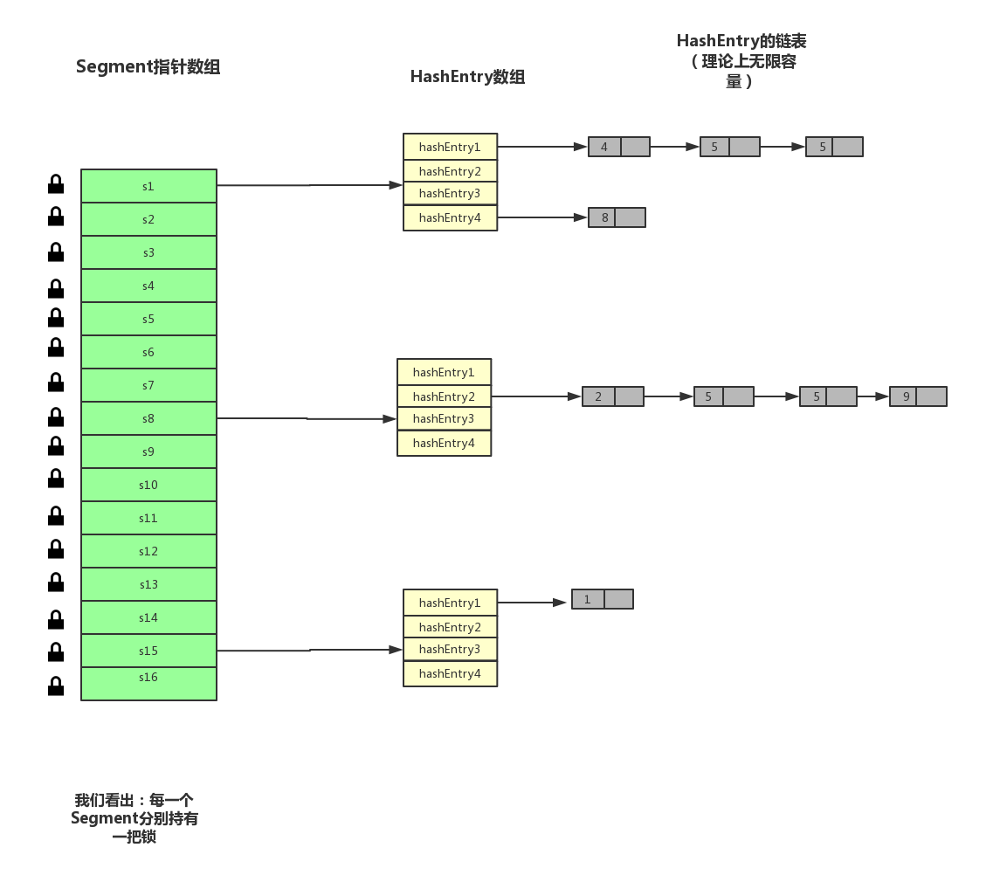

## 并发容器之ConcurrentHashMap源码实现
### 一、背景
其实这一小节主要的可以转换为："为什么在多线程环境下使用ConcurrentHashMap,而非HashMap?"
其实我简单总结了三点原因。

1. **HashMap的线程不安全**

   在多线程环境下，使用HashMap进行put操作会引起死循环，导致CPU利用率接近100%，所
   以在并发情况下不能使用HashMap。

   HashMap在并发执行put操作时会引起死循环，是因为多线程会导致HashMap的Entry链表
   形成环形数据结构，一旦形成环形数据结构，Entry的next节点永远不为空，就会产生死循环获
   取Entry。

2. **效率低下的HashTable**

   HashTable容器使用synchronized来保证线程安全，但在线程竞争激烈的情况下HashTable
   的效率非常低下。因为当一个线程访问HashTable的同步方法，其他线程也访问HashTable的同
   步方法时，会进入阻塞或轮询状态。如线程1使用put进行元素添加，线程2不但不能使用put方
   法添加元素，也不能使用get方法来获取元素，所以竞争越激烈效率越低。

3. **ConcurrentHashMap的锁分段技术可有效提升并发访问率**

   HashTable容器在竞争激烈的并发环境下表现出效率低下的原因是所有访问HashTable的
   线程都必须竞争同一把锁，假如容器里有多把锁，每一把锁用于锁容器其中一部分数据，那么
   当多线程访问容器里不同数据段的数据时，线程间就不会存在锁竞争，从而可以有效提高并
   发访问效率，这就是ConcurrentHashMap所使用的锁分段技术。首先将数据分成一段一段地存
   储，然后给每一段数据配一把锁，当一个线程占用锁访问其中一个段数据的时候，其他段的数
   据也能被其他线程访问。
### 二、ConcurrentHashMap实现原理
#### 2.1 原理概述
正如第一节中描述的3个理由，其实其中已经包括了其原理描述。
HashTable容器在竞争激烈的并发环境下表现出效率低下的原因是所有访问HashTable的
线程都必须竞争同一把锁，假如容器里有多把锁，每一把锁用于锁容器其中一部分数据，那么
当多线程访问容器里不同数据段的数据时，线程间就不会存在锁竞争，从而可以有效提高并
发访问效率，这就是ConcurrentHashMap所使用的锁分段技术。首先将数据分成一段一段地存
储，然后给每一段数据配一把锁，当一个线程占用锁访问其中一个段数据的时候，其他段的数
据也能被其他线程访问。

暂时先这里理解，下面解析ConcurrentHashMap的属性、构造器及内部类的时候，你就会明白上面的那段话。
#### 2.2 原理图

记住这张图的样子，在后面的操作的逻辑可以大概联想这张图进行思考，应该会顺畅很多
### 三、源码分析
#### 3.1 字段
#### 3.2 构造器
#### 3.3 核心内部类-Segment
#### 3.4 常见操作
1. put()
2. get()
3. remove()
### 四、总结

