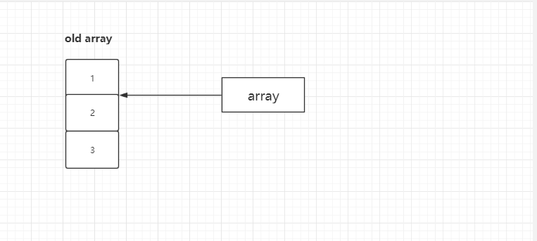
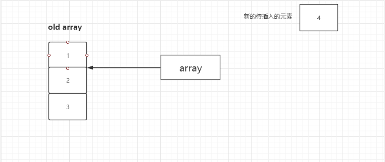
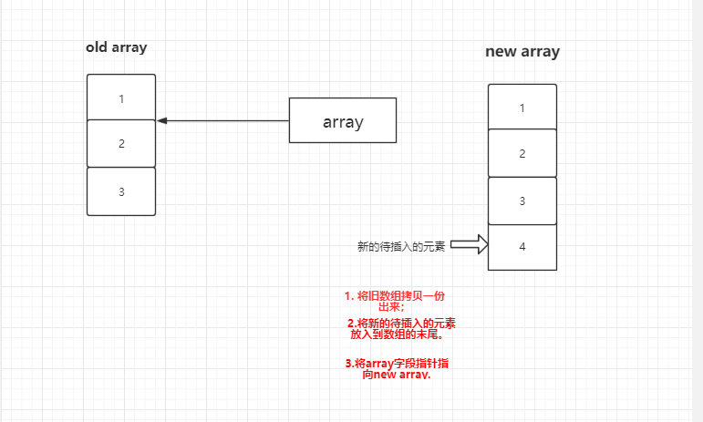
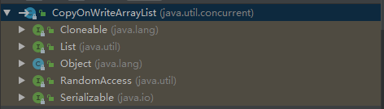

## 并发容器之CopyOnWriteArrayList源码实现
## 一、背景介绍
1. 使用示例

``` 
public class TestCopyOnWriteArrayList {

    public static void main(String[] args) throws Exception {
        List<Integer> list = new CopyOnWriteArrayList<>();
        WriteThread writeThread01 = new WriteThread(list);
        WriteThread writeThread02 = new WriteThread(list);
        WriteThread writeThread03 = new WriteThread(list);
        WriteThread writeThread04 = new WriteThread(list);
        WriteThread writeThread05 = new WriteThread(list);

        ReadThread readThread01 = new ReadThread(list);
        ReadThread readThread02 = new ReadThread(list);

        readThread01.start();
        writeThread01.start();
        writeThread02.start();
        writeThread03.start();
        writeThread04.start();
        readThread02.start();
        writeThread05.start();

        System.out.println("copyList size = " + list.size());
    }

    static class ReadThread extends Thread {

        private List<Integer> list;

        public ReadThread(List<Integer> list) {
            this.list = list;
        }

        @Override
        public void run() {
            for (Integer integer : list) {
                System.out.println("ReadThread = " + integer);
            }
        }
    }

    static class WriteThread extends Thread {

        private List<Integer> list;

        public WriteThread(List<Integer> list) {
            this.list = list;
        }

        @Override
        public void run() {
            int randomInt = new Random().nextInt();
            System.out.println("WriteThread add " + randomInt);
            list.add(randomInt);
        }
    }
}
```

多次运行以上测试代码均发现：并没有发生ArrayList的所抛出的异常（ConcurrentModificationException），即fast-fail的
错误机制。

2. CopyOnWriteArrayList简单介绍
   1. 首先它是<span style="color:red">线程安全的</span>；
   2. 拥有List的所有的基础功能；
   3. 比较适用于多读少写的并发场景；
   4. 使用<span style="color:red">写时复制</span>的方法来实现线程安全。
      
      什么是写时复制？比如说<span style="color:red">在插入新元素的时候，将原有的数据拷贝一份出来，在新的
      数组进行写入操作，待写入操作完成后，使用新的元素数组替代旧的元素数组（即修改数组引用指针）</span>。
      
## 二、实现原理
以插入为例说明：

1. 初始状态



2. 插入前



3. 插入



整个add(E e)方法时加锁的，以保证多个线程进行add,造成array指向混乱。


## 三、源码解析
1. 类关系
``` 
public class CopyOnWriteArrayList<E>
    implements List<E>, RandomAccess, Cloneable, java.io.Serializable {
    
    // 省略
}
```



2. 属性

``` 
    // 锁
    final transient ReentrantLock lock = new ReentrantLock();

    // 数组
    private transient volatile Object[] array;

```

3. 构造器

``` 
    // 空参构造器
    public CopyOnWriteArrayList() {
        setArray(new Object[0]);
    }

    public CopyOnWriteArrayList(Collection<? extends E> c) {
        Object[] elements;
        if (c.getClass() == CopyOnWriteArrayList.class)
            elements = ((CopyOnWriteArrayList<?>)c).getArray();
        else {
            elements = c.toArray();
            // c.toArray might (incorrectly) not return Object[] (see 6260652)
            if (elements.getClass() != Object[].class)
                elements = Arrays.copyOf(elements, elements.length, Object[].class);
        }
        setArray(elements);
    }
    
    public CopyOnWriteArrayList(E[] toCopyIn) {
        setArray(Arrays.copyOf(toCopyIn, toCopyIn.length, Object[].class));
    }
```
4. 常见方法
   
   1. add(E e)
      ``` 
          // 1. 获取锁，并上锁；
          // 2. 根据原来数组拷贝一份新的数组；
          // 3. 在新数组上的尾部添加元素；
          // 4. 修改array指针指向新的数组，添加完成，释放锁。
          public boolean add(E e) {
              final ReentrantLock lock = this.lock;
              lock.lock();
              try {
                  Object[] elements = getArray();
                  int len = elements.length;
                  Object[] newElements = Arrays.copyOf(elements, len + 1);
                  newElements[len] = e;
                  setArray(newElements);
                  return true;
              } finally {
                  lock.unlock();
              }
          }
      ```
      
      根据以上代码我们可以得知：
      - 如果写操作未完成，那么直接读取原数组的数据； 
      - 如果写操作完成，但是引用还未指向新数组，那么也是读取原数组数据； 
      - 如果写操作完成，并且引用已经指向了新的数组，那么直接从新数组中读取数据。
   2. get(int index)
      ``` 
          public E get(int index) {
              return get(getArray(), index);
          }
          
          // 返回底层数组
          final Object[] getArray() {
              return array;
          }
          
          // 根据下标获取元素
          // 稍微有数据结构基础的这点理解起来很简单
          private E get(Object[] a, int index) {
              return (E) a[index];
          }
      ```
## 四、使用
1. 适用场景

通过上面的分析，CopyOnWriteArrayList 有几个缺点： 
- 由于写操作的时候，需要拷贝数组，会消耗内存，如果原数组的内容比较多的情况下，可能导致young gc或者full gc，甚至内存溢出；

- 不能用于实时读的场景，像拷贝数组、新增元素都需要时间，所以调用一个set操作后，读取到数据可能还是旧的,
  虽然CopyOnWriteArrayList 能做到最终一致性,但是还是没法满足实时性要求。
  
所以，<span style="color:red">CopyOnWriteArrayList适合读多写少的场景。</span>

但是其add，set都要重新复制数组，这个代价实在太高昂了。在高并发的项目中，这种操作十分危险。
要十分慎重。

## 五、其他
1. 设计思想
   - 读写分离，读和写分开；
   - 数据的最终一致性；
   - 以空间来换时间，来解决并发问题。
