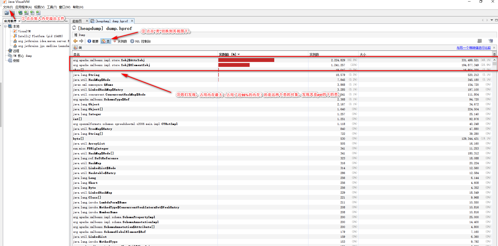

# 超大数据量Excel导入和导出（支持10万+）

## 一、现状

假设我们的测试或生产环境的内存条件有限，比如说2GB（当然小数据的导入和导出不在本文的讨论范围，因为导入和导出它们几乎不存在内存溢出问题）。

这里，我们假如：项目中有50W条及以上数据需要进行excel导入和导出。使用普通的POI包中`HSSFWorkbook`(2003版及以前的版本)和`XSSFWorkbook`(2007版及以后的版本)，
很容易造成内存溢出，从而`无法实现`正确的`导入`和`导出`功能。

这个时候我们应该应该怎么办呢？

- 增加测试或生产环境的内存大小，比如说分配100GB甚至是更大的内存
- 使用POI的事件驱动模式实现消耗较低地内存大小实现导入10w、50w、甚至更多的数据

当然本文主要探讨的是**第二种方案的实现及细节问题**。第一个解决方案往往因为我们的客观限制并不是那么容易实现，所以我个人也比较推荐遇到这类问题，使用
第二种方法解决此类问题。

## 二、技术前瞻

POI提供了HSSF和XSSF的API可以自JAVA中读取修改xls/xlsx文件，但是自面对大文件时就容易报出OOM，
因此提供了接口可以以流式的方式读取/写入(xls/xlsx）。

    | excel类型        | 普通数据量    |  超大数据量  |
    | --------        | -----:       | :----: |
    | xls             | 读写均支持(HSSF即可)      |   仅支持流式读取    |
    | xlsx            | 读写均支持(XSSF即可)      |   读写均支持(sax流式读取；SXSSF流式写出)     |

鉴于目前我们项目中使用的均是office2007以后的版本，所以xls的读写在这里就不做过多演示和说明。

## 二、海量读取

### 2.1 线上内存溢出问题演示

**环境准备**

- 准备一个大的excel文件（xlsx大小10M及以上）
- 将jvm的heap缩小到500m(JVM 参数 `-Xmx500m`)用于模拟OOM
- 使用参数在OOM时dump内存快照 `-XX:+HeapDumpOnOutOfMemoryError -XX:HeapDumpPath=d://dump.hprof`

**依赖管理**

```xml
		<!-- https://mvnrepository.com/artifact/org.apache.poi/poi-ooxml -->
		<dependency>
			<groupId>org.apache.poi</groupId>
			<artifactId>poi-ooxml</artifactId>
			<version>4.1.0</version>
		</dependency>

		<!-- https://mvnrepository.com/artifact/xerces/xercesImpl -->
		<dependency>
			<groupId>xerces</groupId>
			<artifactId>xercesImpl</artifactId>
			<version>2.11.0</version>
		</dependency>
```

**运行代码**

```java
/**
 * 超大excel读取示例
 *
 * @author Leon
 * @version 2020/5/5 20:07
 */
public class ReadExcelDemo
{
	public static void main(String[] args) throws Exception
	{
		FileInputStream is = new FileInputStream("d:\\test.xlsx");
		XSSFWorkbook wb = new XSSFWorkbook(is);
		// TODO with wb
		System.out.println("ok");
	}
}
```

**运行结果**

```text
java.lang.OutOfMemoryError: Java heap space
Dumping heap to d://dump.hprof ...
Exception in thread "main" java.lang.OutOfMemoryError: Java heap space
	at java.io.ByteArrayOutputStream.<init>(ByteArrayOutputStream.java:77)
	at org.apache.poi.util.IOUtils.toByteArray(IOUtils.java:147)
	at org.apache.poi.util.IOUtils.toByteArray(IOUtils.java:121)
	at org.apache.poi.openxml4j.util.ZipArchiveFakeEntry.<init>(ZipArchiveFakeEntry.java:47)
	at org.apache.poi.openxml4j.util.ZipInputStreamZipEntrySource.<init>(ZipInputStreamZipEntrySource.java:53)
	at org.apache.poi.openxml4j.opc.ZipPackage.<init>(ZipPackage.java:106)
	at org.apache.poi.openxml4j.opc.OPCPackage.open(OPCPackage.java:301)
	at org.apache.poi.ooxml.util.PackageHelper.open(PackageHelper.java:37)
	at org.apache.poi.xssf.usermodel.XSSFWorkbook.<init>(XSSFWorkbook.java:303)
	at com.concurrent.excel.ReadExcelDemo.main(ReadExcelDemo.java:20)
```

**dump.hprof文件分析**

使用jdk自带的`jvisualvm`打开此文件。如下图：



原因总结：处理xlsx时会将数据完全读入内存，导致内存溢出。根据笔者的经验，10m的excel在后台完全处理的情况至少需要2GB内存，这个
放大的倍数还是很吓人的，怪不得造成内存溢出。

### 2.2 小内存实现海量excel数据读取

上一小节，我们已经定位在OOM的原因，针对这种情况，POI官方也给出了解决方案。就是事件驱动模式（Event API）。

- 官网的相关链接： [POI官网链接及示例代码](http://poi.apache.org/components/spreadsheet/how-to.html#xssf_sax_api) 
- 官网的相关链接： [POI issue列表 请看第14个](http://poi.apache.org/help/faq.html) 

**示例代码**

此代码可以直接拷贝使用或者稍加改造即可在项目中使用。

```java

/**
 * 事件驱动：超大excel读取示例
 *
 * @author Leon
 * @version 2020/5/5 20:07
 */
public class EventReadExcelDemo
{
	public static void main(String[] args) throws Exception
	{
		new EventReadExcelDemo().processOneSheet("d:\\test.xlsx");
		System.out.println("ok");
	}

	public void processOneSheet(String filename) throws Exception {
		OPCPackage pkg = OPCPackage.open(filename);
		XSSFReader r = new XSSFReader(pkg);
		SharedStringsTable sst = r.getSharedStringsTable();

		XMLReader parser = fetchSheetParser(sst);

		// 获得第一个sheet
		InputStream sheet2 = r.getSheet("rId1");
		InputSource sheetSource = new InputSource(sheet2);
		parser.parse(sheetSource);
		sheet2.close();
	}

	public XMLReader fetchSheetParser(SharedStringsTable sst) throws SAXException {
		XMLReader parser =
			XMLReaderFactory.createXMLReader(
				"org.apache.xerces.parsers.SAXParser"
			);
		ContentHandler handler = new SheetHandler(sst);
		parser.setContentHandler(handler);
		return parser;
	}

	private static class SheetHandler extends DefaultHandler {
		private SharedStringsTable sst;
		private String lastContents;
		private boolean nextIsString;

		private SheetHandler(SharedStringsTable sst) {
			this.sst = sst;
		}

		//元素开始时的handler
		public void startElement(String uri, String localName, String name,
		                         Attributes attributes) throws SAXException {
			// c => 单元格
			if(name.equals("c")) {
				System.out.print(attributes.getValue("r") + " - ");
				// 获取单元格类型
				String cellType = attributes.getValue("t");
				if(cellType != null && cellType.equals("s")) {
					nextIsString = true;
				} else {
					nextIsString = false;
				}
			}
			lastContents = "";
		}

		//元素结束时的handler
		public void endElement(String uri, String localName, String name)
			throws SAXException {
			if(nextIsString) {
				int idx = Integer.parseInt(lastContents);
				lastContents = new XSSFRichTextString(sst.getEntryAt(idx)).toString();
				nextIsString = false;
			}

			// v => 单元格内容
			if(name.equals("v")) {
				System.out.println(lastContents);
			}
		}

		//读取元素间内容时的handler
		public void characters(char[] ch, int start, int length)
			throws SAXException {
			lastContents += new String(ch, start, length);
		}
	}
}

```

**运行结果**

```text
....
E153797 - A153798 - xxxxx信息内容
B153798 - 2953
C153798 - 落叶灌木
D153798 - 木芙蓉
...
```

我们发现： 运行了到15万行了，也没有发生内存溢出。

### 2.3 小结

同样的使用这种方法可以**流式**读取打的xlsx文件，但是只限于**读取**内部的数据，而且**无法进行修改操作**。

之后会介绍写大文件的方法。

## 三、海量写出

## 四、总结
