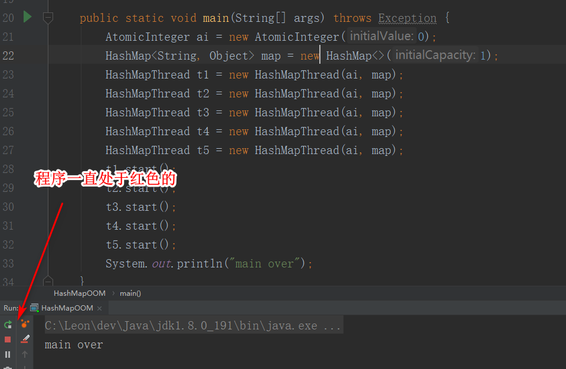
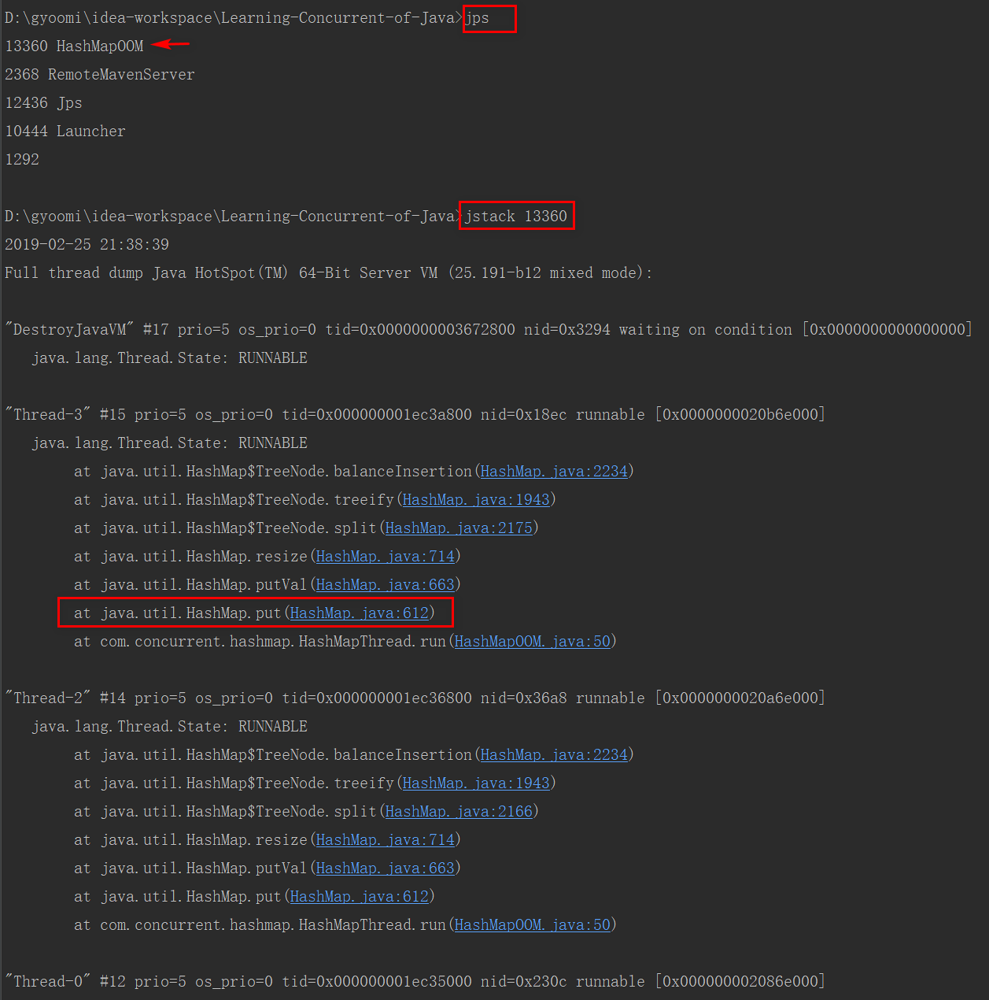
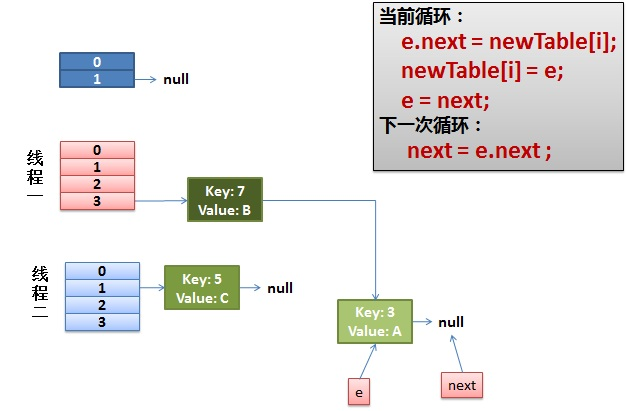

## 史上最强HashMap的死循环源码分析---超详细的分析过程
### 一、背景
之前公司一个项目偶尔会遇到服务器造成CPU100%，导致服务异常缓慢甚至挂掉。重启后问题消失，隔一段时间又会反复出现。
后来<font color='red'>通过jps获取Java进程的PID，jstack pid >> java.txt 导出CPU占用高进程的线程栈。发现问题发生在HashMap的put()方法处</font>。

后来在查询相关书籍和网络资料之后，发现这个问题还是很典型，在网上找到很多，但是很多真的就是复制copy,看完之后让人摸不着头脑。
后来找到一篇很好的文章，文章主要以那篇文章分析部分，加上自己的理解和分析。
### 二、问题重现
1. 代码
   ```
   public class HashMapOOM {
   
       public static void main(String[] args) throws Exception {
           AtomicInteger ai = new AtomicInteger(0);
           HashMap<String, Object> map = new HashMap<>(1);
           HashMapThread t1 = new HashMapThread(ai, map);
           HashMapThread t2 = new HashMapThread(ai, map);
           HashMapThread t3 = new HashMapThread(ai, map);
           HashMapThread t4 = new HashMapThread(ai, map);
           HashMapThread t5 = new HashMapThread(ai, map);
           t1.start();
           t2.start();
           t3.start();
           t4.start();
           t5.start();
           System.out.println("main over");
       }
   }
   
   class HashMapThread extends Thread {
   
       private AtomicInteger ai;
       private HashMap<Integer, Object> map;
   
       public HashMapThread(AtomicInteger ai, HashMap map) {
           this.ai = ai;
           this.map = map;
       }
   
       @Override
       public void run() {
           while (ai.get() < 1000000) {
               map.put(ai.get(), "");
               ai.incrementAndGet();
           }
       }
   }
   ```
2. 结果
   1. 现象（并不是每次运行就会出现如下问题,大概运行几次就会出现如下现象.）

      

   2. 问题定位

      

### 三、过程分析
1. Hash表的数据结构（典型的以空间换时间）

   HashMap通常会用一个指针数组（假设为table[]）来做分散所有的key，当一个key被加入时，
   会通过Hash算法通过key算出这个数组的下标i，然后就把这个<key, value>插到table[i]中，
   如果有两个不同的key被算在了同一个i，那么就叫冲突，又叫碰撞，这样会在table[i]上形成一个链表。

   我们知道，如果table[]的尺寸很小，比如只有2个，如果要放进10个keys的话，那么碰撞非常频繁，
   于是一个O(1)的查找算法，就变成了链表遍历，性能变成了O(n)，这是Hash表的缺陷。

   所以，Hash表的尺寸和容量非常的重要。一般来说，Hash表这个容器当有数据要插入时，都会检查容量
   有没有超过设定的thredhold，如果超过，需要增大Hash表的尺寸，但是这样一来，整个Hash表里的无素都需要被重算一遍。
   这叫rehash，这个成本相当的大。
2. HashMap的rehash源代码(JDK1.7)

   put一个Key,Value对到Hash表中:

   ```
   public V put(K key, V value)
   {
       ......
       //算Hash值
       int hash = hash(key.hashCode());
       int i = indexFor(hash, table.length);
       //如果该key已被插入，则替换掉旧的value （链接操作）
       for (Entry<K,V> e = table[i]; e != null; e = e.next) {
           Object k;
           if (e.hash == hash && ((k = e.key) == key || key.equals(k))) {
               V oldValue = e.value;
               e.value = value;
               e.recordAccess(this);
               return oldValue;
           }
       }
       modCount++;
       //该key不存在，需要增加一个结点
       addEntry(hash, key, value, i);
       return null;
   }
   ```

   检查容量是否超标:

   ```
   void addEntry(int hash, K key, V value, int bucketIndex)
   {
       Entry<K,V> e = table[bucketIndex];
       table[bucketIndex] = new Entry<K,V>(hash, key, value, e);
       //查看当前的size是否超过了我们设定的阈值threshold，如果超过，需要resize
       if (size++ >= threshold)
           resize(2 * table.length);
   }
   ```

   新建一个更大尺寸的hash表，然后把数据从老的Hash表中迁移到新的Hash表中:

   ```
   void resize(int newCapacity)
   {
       Entry[] oldTable = table;
       int oldCapacity = oldTable.length;
       ......
       //创建一个新的Hash Table
       Entry[] newTable = new Entry[newCapacity];
       //将Old Hash Table上的数据迁移到New Hash Table上
       transfer(newTable);
       table = newTable;
       threshold = (int)(newCapacity * loadFactor);
   }
   ```

   迁移的源代码，注意高亮处：

   ```
   void transfer(Entry[] newTable)
   {
       Entry[] src = table;
       int newCapacity = newTable.length;
       //下面这段代码的意思是：
       //  从OldTable里摘一个元素出来，然后放到NewTable中
       for (int j = 0; j < src.length; j++) {
           Entry<K,V> e = src[j];
           if (e != null) {
               src[j] = null;
               do {
                   Entry<K,V> next = e.next;
                   int i = indexFor(e.hash, newCapacity);
                   e.next = newTable[i];
                   newTable[i] = e;
                   e = next;
               } while (e != null);
           }
       }
   }
   ```

   好了，这个代码算是比较正常的。而且没有什么问题。

3. 正常的ReHash的过程
   1. 前提背景
      1. 我假设了我们的hash算法就是简单的用key mod 一下表的大小（也就是数组的长度）；
      2. 最上面的是old hash 表，其中的Hash表的size=2, 所以key = 3, 7, 5，在mod 2以后都冲突在table[1]这里了；
      3. 接下来的三个步骤是Hash表 resize成4，然后所有的<key,value> 重新rehash的过程。
   2. 图解过程

      

   3. 过程说明
      其实这个过程没什么说的，就是按照上述代码执行后的结果。注意在rehash的过程中时候使用的是头插法。从
      ```
      e.next = newTable[i];
      ```
      可以看出来。
4. 并发下的Rehash
   1. 前提背景
      1. <font color='red'>假设我们有两个线程。我用红色和浅蓝色标注了一下</font>；
      2. 我假设了我们的hash算法就是简单的用key mod 一下表的大小（也就是数组的长度）；
      3. 最上面的是old hash 表，其中的Hash表的size=2, 所以key = 3, 7, 5，在mod 2以后都冲突在table[1]这里了；
      4. 接下来的三个步骤是Hash表 resize成4，然后所有的<key,value> 重新rehash的过程。
   2. 图解过程
      1. 第一步：

         我们再回头看一下我们的 transfer代码中的这个细节：
         <font color='red'>线程一先执行到下面的代码行时，被挂起了。</font>
         ```
         do {
             Entry<K,V> next = e.next; // <--- 假设线程一执行到这里就被调度挂起了 e=3 next=7
             int i = indexFor(e.hash, newCapacity);
             e.next = newTable[i];
             newTable[i] = e;
             e = next;
         } while (e != null);
         ```

         <font color='red'>而我们的线程二执行完成了。于是我们有下面的这个样子。</font>

         

         <font color='red'>注意，因为线程一的e 指向了key(3)，而next指向了key(7)，其在线程二rehash后，
         指向了线程二重组后的链表。我们可以看到链表的顺序被反转后</font>。

      2. 第二步：

         <font color='red'>线程一被调度回来执行。</font>

         - 先是执行 newTable[i] = e。此时newTable[3]=3, e=3
         - 然后是e = next，导致了e指向了key(7)。此时e=next=7
         - 而下一次循环的e=7，而e.next=3。根据此时的图得知下一次的e=7,e.next=3

         

      3. 第三步：

         <font color='red'>线程一接着工作。把key(7)摘下来，放到newTable[i]的第一个，然后把e和next往下移。</font>

         ```
         do { //此时e=7。由上一步可以得知。
             Entry<K,V> next = e.next; // next=3
             int i = indexFor(e.hash, newCapacity); // i=3还是3
             e.next = newTable[i]; // 此时newTable[3]=3
             newTable[i] = e; // newTable[3]=7->3;
             e = next;// 此时e=next=3
         } while (e != null); 
         ```
         - 下一次循环的e=3,e.next=null

         

      4. 第四步：

         <font color='red'>结论：这一步执行完成后，环形链表出现。</font>

         ```
         do { //传入的e=3,e.next=null
             Entry<K,V> next = e.next; // 此时next=null
             int i = indexFor(e.hash, newCapacity); // i=3
             e.next = newTable[i]; // e.next=7<->3。也就是7的next指向了3（上一步完成），3的next指向了7（本行代码完成）
             newTable[i] = e;// 此时newTable[3]=7<->3
             e = next; // e=null
         } while (e != null); // 此时退出程序。
         ```

        <font color='red'>说明：执行到底，程序因为null的原因退出了循环，好像并没有什么问题。的确对于此次操作的确并没有毛病。
        但是对于table[3]=7<->3这样一个环形链表。到程序执行put或get时此位置就会出现问题。出现死循环从而导致CPU占用过高的问题。
        比如说此时程序调用get(11)就会infinite loop</font>

        

### 四、使用建议
1. 解决方案
   1. <font color='red'>使用线程安全的HashTable类（不推荐）</font>
   2. <font color='red'>使用Collections.synchronizedMap(Mao<K,V> m)方法把HashMap变成一个线程安全的Map（推荐度一般）</font>
   3. <font color='red'>推荐使用JUC包下的ConcurrentHashMap集合（推荐）</font>
2. 关于HashMap
   不了解HashMap,请先阅读 [Map之HashMap源码实现](https://blog.csdn.net/weixin_39723544/article/details/83033694)
3. 关于版本
   <font color='red'>分析此问题的版本是JDK1.7；虽然JDK1.8有所代码改变，但是依然没有解决死循环的问题，只是产生问题的方式不太一样。后面有时间在分析。</font>
4. 参考文章
   1. https://coolshell.cn/articles/9606.html
   2. 《Java并发编程的艺术》一书
